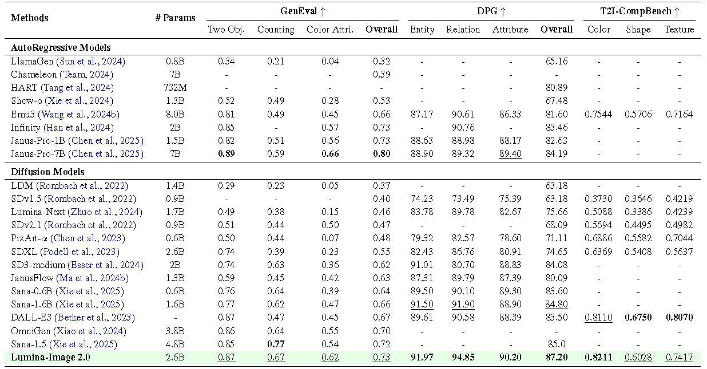

<p align="center">
 
 <br>
</p>

<div align="center">
<h1> Lumina-Image 2.0 : A Unified and Efficient Image Generative Model </h1>

</div>
<div align="center">

[-yellow?logoColor=violet&label=%F0%9F%A4%97%20Lumina-Image-2.0%20checkpoints)](https://huggingface.co/Alpha-VLLM/Lumina-Image-2.0)
[](http://47.100.29.251:11001/)&#160;

[](https://magic-animation.intern-ai.org.cn/image/create)&#160;
[](http://47.100.29.251:10010/)&#160;

</div>


## 📰 News
- [2024-2-5] **[ComfyUI](https://huggingface.co/Comfy-Org/Lumina_Image_2.0_Repackaged) now supports Lumina-Image 2.0!** 🎉 Thanks to **ComfyUI**[@ComfyUI](https://github.com/comfyanonymous/ComfyUI)! 🙌 Feel free to try it out! 🚀
- [2024-1-31] We have released the latest .pth format weight file [Google Drive](https://drive.google.com/drive/folders/1LQLh9CJwN3GOkS3unrqI0K_q9nbmqwBh?usp=drive_link).
- [2024-1-25] 🚀🚀🚀 We are excited to release `Lumina-Image 2.0`, including:
  - 🎯 Checkpoints, Fine-Tuning and Inference code.
  - 🎯 Website & Demo are live now! Check out the [Huiying](https://magic-animation.intern-ai.org.cn/image/create) and [Gradio Demo](http://47.100.29.251:10010/)!


## 📑 Open-source Plan

 - [x] Inference 
 - [x] Checkpoints
 - [x] Web Demo (Gradio)
 - [x] Finetuning code
 - [x] ComfyUI
 - [ ] Diffusers
 - [ ] Technical Report
 - [ ] Unified multi-image generation
 - [ ] Control
 - [ ] PEFT (LLaMa-Adapter V2)

## 🎥 Demo


<div align="center">
  <video src="https://github.com/user-attachments/assets/b1d6dddf-4185-492d-b804-47d3d949adb5" width="70%"> </video>
</div>

## 🎨 Qualitative Performance


## 📊 Quantatitive Performance



## 🎮 Model Zoo


| Resolution | Parameter| Text Encoder | VAE | Download URL  |
| ---------- | ----------------------- | ------------ | -----------|-------------- |
| 1024       | 2.6B             |    [Gemma-2-2B](https://huggingface.co/google/gemma-2-2b)  |   [FLUX-VAE-16CH](https://huggingface.co/black-forest-labs/FLUX.1-dev/tree/main/vae) | [hugging face](https://huggingface.co/Alpha-VLLM/Lumina-Image-2.0) |

## 💻 Finetuning Code
### 1. Create a conda environment and install PyTorch
```bash
conda create -n Lumina2 -y
conda activate Lumina2
conda install python=3.11 pytorch==2.1.0 torchvision==0.16.0 torchaudio==2.1.0 pytorch-cuda=12.1 -c pytorch -c nvidia -y
```
### 2.Install dependencies
```bash
pip install -r requirements.txt
```
### 3. Install flash-attn
```bash
pip install flash-attn --no-build-isolation
```
### 4. Prepare data
You can place the links to your data files in `./configs/data.yaml`. Your image-text pair training data format should adhere to the following:
```json
{
    "image_path": "path/to/your/image",
    "prompt": "a description of the image"
}
```
### 5. Start finetuning
```bash
bash scripts/run_1024_finetune.sh
```
## 🚀 Inference Code
We support multiple solvers including Midpoint Solver, Euler Solver, and **DPM Solver** for inference.
> [!Note]
> Both the Gradio demo and the direct inference method use the .pth format weight file, which can be downloaded from [Google Drive](https://drive.google.com/drive/folders/1LQLh9CJwN3GOkS3unrqI0K_q9nbmqwBh?usp=drive_link).

> [!Note]
> You can also directly download from [huggingface](https://huggingface.co/Alpha-VLLM/Lumina-Image-2.0/tree/main). We have uploaded the .pth weight files, and you can simply specify the `--ckpt` argument as the download directory.
- Gradio Demo
```python   
python demo.py \
    --ckpt /path/to/your/ckpt \
    --res 1024 \
    --port 12123
``` 


- Direct Batch Inference
```bash
bash scripts/sample.sh
```


